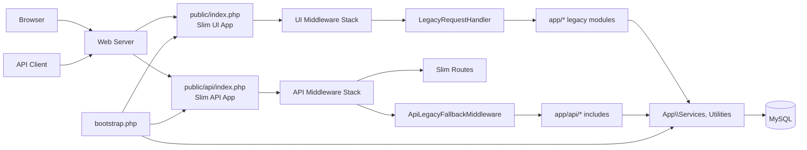
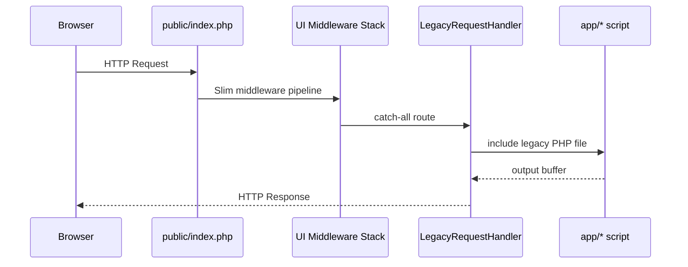
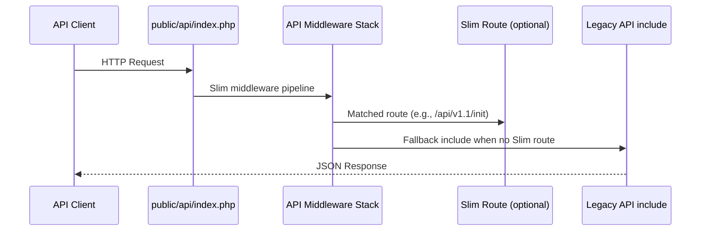

# Architecture

This codebase is a legacy PHP application that has been partially modernized with Slim 4
and a PHP-DI container. The UI and API entry points now run through Slim middleware stacks,
but most request handling still delegates to legacy include-style PHP scripts under `app/`.

## High-Level Map

## Entry Points

- Web UI: `public/index.php` builds a Slim app, adds middleware, then delegates all
  routes to `App\HttpHandlers\LegacyRequestHandler`.
- API: `public/api/index.php` builds a Slim app, registers minimal routes, then falls
  back to legacy includes via `App\Middlewares\Api\ApiLegacyFallbackMiddleware`.
- CLI/Tasks: `bin/*`, `app/tasks/*`, and `vendor/bin/crunz` scripts are used for
  maintenance, background jobs, and setup.

## Bootstrap and Configuration

- `bootstrap.php` sets session/cookie policies, defines paths, loads Composer autoload,
  loads system constants and version, registers DI, and installs error/exception handlers.
- Environment config is loaded from `configs/config.<env>.php` (defaulting to production).
- Module toggles and system settings live in the config file (see `configs/`).

## Dependency Injection and Registries

- PHP-DI container setup lives in `app/system/di.php`.
- The container is stored in `App\Registries\ContainerRegistry` for global access.
- `App\Registries\AppRegistry` stores per-request data (e.g., current request/URI).

## Web UI Request Flow

### UI Middleware Stack (order of execution)

- Error handling: `App\Middlewares\ErrorHandlerMiddleware`
- Security headers/CSP
- CORS: `App\Middlewares\CorsMiddleware`
- Request context: sets `AppRegistry` values
- Auth split: `SystemAdminAuthMiddleware` or `AppAuthMiddleware`
- CSRF: `App\Middlewares\App\CSRFMiddleware`
- ACL: `App\Middlewares\App\AclMiddleware`

## API Request Flow

### API Middleware Stack (order of execution)

- Error handling: `App\Middlewares\Api\ApiErrorHandlingMiddleware`
- CORS (including preflight handling)
- Body parsing: `Slim\Middleware\BodyParsingMiddleware`
- JSON content-type enforcement
- Auth: `App\Middlewares\Api\ApiAuthMiddleware`
- Request context: `AppRegistry` request
- Legacy fallback: `App\Middlewares\Api\ApiLegacyFallbackMiddleware`
- Content-Length header

## Legacy Application Layout

Most business logic and UI pages are in legacy include-based modules under `app/`:

- `app/<module>/` feature folders (e.g., `vl`, `eid`, `tb`, `covid-19`, `dashboard`)
- `app/common/`, `app/includes/` shared includes and helpers
- `app/header.php`, `app/footer.php`, `app/index.php` UI scaffolding and redirects
- `app/api/` versioned API scripts (e.g., `app/api/v1.1/*`)
- `app/classes/` modern PHP classes (services, utilities, middlewares, registries)

## Services, Utilities, and Domain Classes

PSR-4 autoloaded classes live under `app/classes/`:

- `Services/` core services (DB, system, common helpers)
- `Middlewares/` Slim middleware for UI and API
- `HttpHandlers/` request handlers (legacy bridge)
- `Utilities/` logging, helpers, and shared tools
- `Interop/` external system integrations (DHIS2, FHIR)

These are auto-registered into the DI container and can be fetched via `ContainerRegistry`.

## Background Jobs and Maintenance

- Scheduled jobs are defined for Crunz via `crunz.yml`.
- `cron.sh` and `vendor/bin/crunz` run scheduled tasks.
- CLI scripts live in `bin/` and `app/tasks/` (remote sync, archiving, migrations).

## Data, Files, and Assets

- Web root: `public/`
- Static assets: `public/assets/`
- Uploads: `public/uploads/`
- Temporary files: `public/temporary/`
- Runtime cache/logs: `var/cache/`, `var/logs/`
- Backups: `backups/`
- SQL schema and utilities: `sql/`, `db-tools.php`

## Integration Points

- Remote sync workflows live in `app/remote/` and `app/tasks/remote/`.
- External service clients are in `app/classes/Interop/`.

## Notes for Ongoing Modernization

- Slim is currently used as the entry layer and middleware pipeline.
- Most routes still resolve to legacy PHP includes. Gradual refactors can move legacy
  pages into Slim routes or controllers while retaining middleware coverage.
