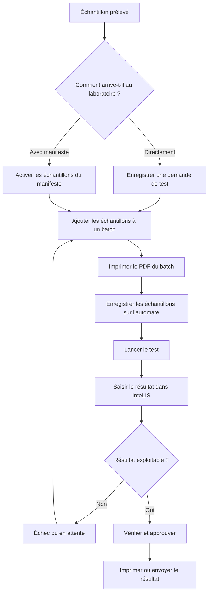

# Le parcours d'un échantillon dans InteLIS

Cette page explique le trajet d'un échantillon, du prélèvement jusqu'au résultat
remis au clinicien. La lire une fois pour comprendre l'organisation du travail.
Les guides de cette section donnent les étapes.

## Les deux voies d'arrivée au laboratoire

Un laboratoire de test reçoit les échantillons par l'une des deux voies
suivantes.

**Directement au laboratoire.** L'échantillon arrive au laboratoire avec une
fiche papier. Un utilisateur du laboratoire l'enregistre et InteLIS attribue
l'ID de l'échantillon.

**Envoyé avec un manifeste.** Une structure sanitaire enregistre elle-même ses
demandes, prépare le colis et génère un manifeste. Le manifeste liste tous les
ID des échantillons du colis. À l'arrivée, un utilisateur du laboratoire saisit
le code du manifeste et active la liste entière en une seule action.

La seconde voie déplace la saisie vers le site qui a prélevé l'échantillon. Le
laboratoire saisit un seul code au lieu d'un formulaire par échantillon.

## Les étapes

## Pourquoi le PDF du batch est essentiel

L'automate et InteLIS ne s'accordent que sur une seule donnée : l'ID de
l'échantillon. Si l'ID saisi sur l'automate diffère d'un seul caractère de l'ID
enregistré dans InteLIS, le résultat revient et ne correspond à aucun
échantillon.

Le PDF du batch existe pour éviter cela. Il porte les ID d'échantillon générés
par InteLIS sous forme de codes-barres, dans l'ordre où les échantillons sont
placés dans la série. Scanner depuis le PDF du batch supprime le risque
d'erreur de saisie. Enregistrer les échantillons sur l'automate de mémoire, ou
depuis la fiche papier, réintroduit ce risque.

## Les trois façons de saisir un résultat

InteLIS accepte les résultats par trois voies, présentées par ordre de
préférence.

| Voie | Comment le résultat arrive | Approbation |
|---|---|---|
| Outil d'interface | L'automate envoie le résultat à l'outil d'interface, qui le transmet à InteLIS sans aucune saisie | Automatique, si le laboratoire l'a activée |
| Import de fichier | Un utilisateur exporte un fichier de résultats depuis l'automate et le téléverse | L'utilisateur accepte les lignes importées |
| Saisie manuelle | Un utilisateur lit le résultat sur l'automate et le saisit | Nécessite toujours une approbation distincte |

L'outil d'interface est préférable car il supprime toute recopie. La saisie
manuelle est la solution de repli lorsque l'automate ne peut ni se connecter ni
exporter de fichier. Chaque résultat saisi à la main comporte un risque
d'erreur de recopie, et c'est pourquoi il exige toujours l'approbation d'une
seconde personne.

## Qui fait quoi

| Rôle | Travail habituel |
|---|---|
| Personnel de la structure sanitaire | Enregistrer les demandes, constituer les manifestes, consulter les résultats |
| Personnel de saisie du laboratoire | Enregistrer les échantillons directs, activer les manifestes, saisir les résultats |
| Superviseur du laboratoire | Vérifier et approuver les résultats, traiter les échecs, diffuser les rapports |
| Administrateur | Gérer les utilisateurs, les structures, les automates et les listes déroulantes des formulaires |

## Suite

- [Se connecter et naviguer dans InteLIS](signing-in.md)
- [Enregistrer une demande de test de charge virale](register-a-request.md)
- [Réceptionner des échantillons envoyés avec un manifeste](receive-referred-samples.md)
- [Créer un batch pour le test](batch-samples.md)
- [Saisir les résultats de charge virale](capture-results.md)
- [Vérifier et approuver les résultats](approve-results.md)
- [Gérer les échecs et les échantillons en attente](failed-and-held-samples.md)
- [Diffuser les résultats à la structure demandeuse](release-results.md)
- [Statuts des échantillons](sample-statuses.md)
