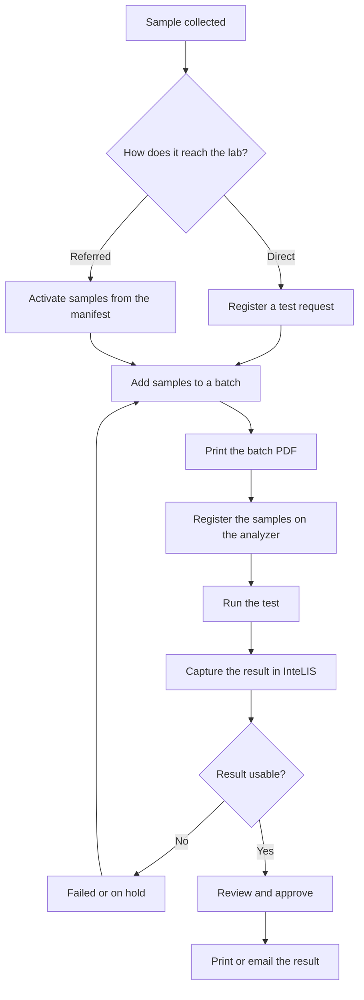

# How a viral load sample moves through InteLIS

This page explains the path a sample takes, from the moment it is collected to
the moment a result reaches the clinician. Read it once to understand the shape
of the work. The task guides in this section give the steps.

## The two ways a sample reaches the lab

A testing lab receives samples by one of two routes.

**Direct to the lab.** The sample arrives at the lab with a paper form. A lab
user registers it in InteLIS and InteLIS issues the Sample ID.

**Referred on a manifest.** A health facility registers its own requests, packs
the samples, and generates a manifest. The manifest lists every Sample ID in the
package. When the package arrives, a lab user enters the manifest code and
activates the whole list in one action.

The second route moves the data entry to the site that collected the sample. The
lab types a single code instead of a form per sample.

## The stages

## Why the batch PDF matters

The analyzer and InteLIS agree on one thing only: the Sample ID. If the ID typed
into the analyzer differs by one character from the ID held in InteLIS, the
result comes back and matches nothing.

The batch PDF exists to prevent that. It carries the InteLIS Sample IDs as
barcodes, in the order the samples sit in the run. Scanning from the batch PDF
removes the chance of a typing error. Registering samples on the analyzer from
memory, or from the paper request form, reintroduces it.

## The three ways a result is captured

InteLIS accepts results by three routes. They are listed in order of preference.

| Route | How the result arrives | Approval |
|---|---|---|
| Interface Tool | The analyzer sends the result to the Interface Tool, which passes it to InteLIS without anyone typing | Automatic, if the lab has enabled it |
| File import | A lab user exports a result file from the analyzer and uploads it | The user accepts the imported rows |
| Manual entry | A lab user reads the result off the analyzer and types it in | Always needs a separate approval |

The Interface Tool is preferred because it removes transcription from the
process entirely. Manual entry is the fallback when the analyzer cannot connect
and cannot export a file. Every manually entered result carries the risk of a
transcription error, which is why it always needs a second person to approve it.

## Who does what

| Role | Typical work |
|---|---|
| Health facility staff | Register requests, build manifests, read results back |
| Lab data entry staff | Register direct samples, activate manifests, capture results |
| Lab supervisor | Review and approve results, handle failures, release reports |
| Administrator | Manage users, facilities, analyzers, and the option lists on the forms |

## Where to go next

- [How to sign in and navigate InteLIS](signing-in.md)
- [How to register a viral load test request](register-a-request.md)
- [How to receive samples sent on a manifest](receive-referred-samples.md)
- [How to batch samples for testing](batch-samples.md)
- [How to capture viral load results](capture-results.md)
- [How to review and approve results](approve-results.md)
- [How to handle failed and held samples](failed-and-held-samples.md)
- [How to release results to the requesting facility](release-results.md)
- [Sample statuses](sample-statuses.md)
